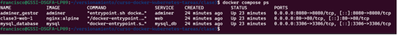
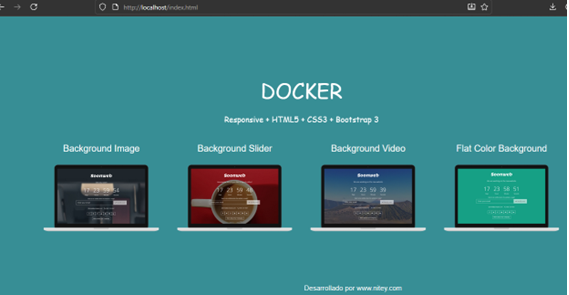
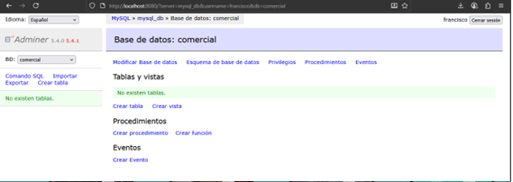
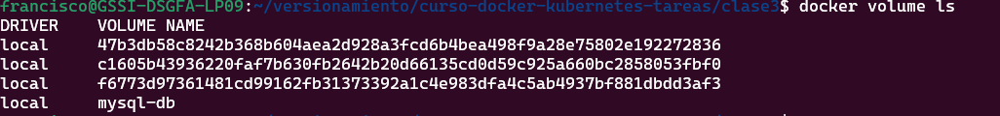
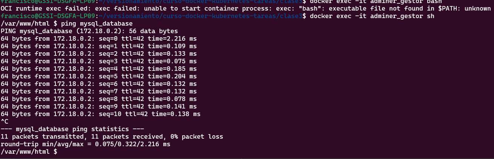
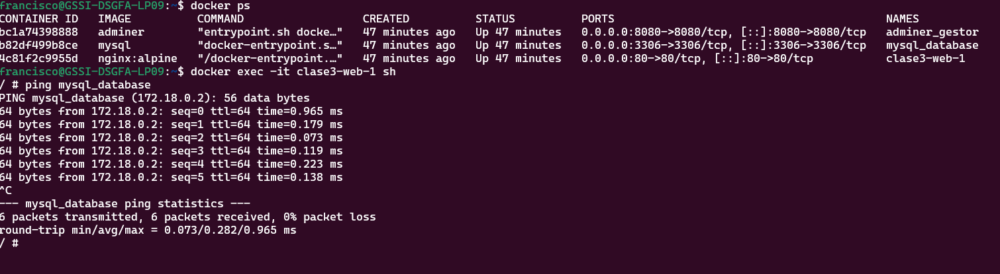

# 

**Curso:** Docker & Kubernetes - Clase 3

**Estudiante:** Francisco H. Flores Huanca

Crea un servicio web con pagina estatitica, un mysql con su gestor adminer todos en el network app_network

## Stack

- **App:** Html
- **Base de datos:** MYSQL /
- **Gestor de datos:** ADMINER /

## Ejecución

1. Clonar:
   git clone https://github.com/franciscohf/curso-docker-kubernetes-tareas.git

   cd curso-docker-kubernetes-tareas

   cd clase3

2. Levantar servicios:
docker compose up -d

3. Acceder:

   API web: http://localhost:80/index.html

   adminer: http://localhost:8080


## Verificación

1. Servicios corriendo:
   ```bash
   docker compose ps
   ```

2. Acceder a la web: http://localhost:80

3. Verificar volumen persiste:
   ```bash
   docker compose down
   docker compose up -d
   docker volume ls  

## Screenshots

### Servicios corriendo


### API funcionando


### GESTOR BD


### volume


### PING


